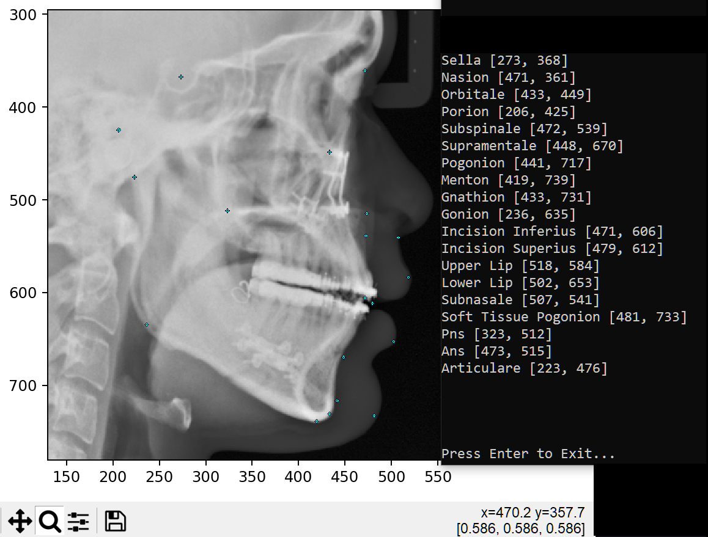

# Predict 19 Cephlometric Landmarks from a Cephalogram
PyTorch solution to find 19 cephalometric landmarks from a lateral cephalogram from CLI.

Model provided to predict landmarks is trained from the source code and datasets from [Cephalometric Landmark Detection by Attentive Feature Pyramid Fusion and Regression-Voting](https://arxiv.org/pdf/1908.08841.pdf). Repo [here](https://github.com/runnanchen/Anatomic-Landmark-Detection).

<br>

# How to use py-ceph?
```commandline
  pip install git+https://github.com/zhangted/py-ceph
```

<br>

## Python (Usage Examples)
```python
  from pyceph import predict

  results = predict(image_src='tests/test-images/001.jpg', device='cpu')
  for res in results: print(res)

  """
  {'Sella': (274, 369), 'Nasion': (472, 358), 'Orbitale': (429, 447), 'Porion': (204, 424), 'Subspinale': (468, 542), 'Supramentale': (446, 669), 'Pogonion': (440, 716), 'Menton': (418, 740), 'Gnathion': (433, 732), 'Gonion': (237, 635), 'Incision Inferius': (470, 609), 'Incision Superius': (476, 612), 'Upper Lip': (521, 585), 'Lower Lip': (503, 654), 'Subnasale': (507, 542), 'Soft Tissue Pogonion': (485, 727), 'Posterior Nasal Spine': (319, 511), 'Anterior Nasal Spine': (474, 518), 'Articulare': (223, 473)}
  """

  results = predict(image_folder='tests/test-images', device=0)
```

## Single file processing (CLI)

```commandline
  py-ceph --image_src [my-single-image-path]
```

Output
- the image interactively with a grid
- the labeled landmarks to the console

<br><br>


## Batch processing (CLI)

```commandline
  py-ceph --image_folder [my-image-folder-path]
```
Output
- create `predicted_images` folder in provided directory
  - each image overlayed with predicted ceph landmarks
  - csv of the coordinates for each labeled landmark

<br><br><br>

## To-do
- <s>Non-CLI usage</s>
- PyPi package

<br>

## Dependencies
- Python 3.10+
- pyyaml
- pytest
- torch
- numpy
- torch
- matplotlib
- scikit-image