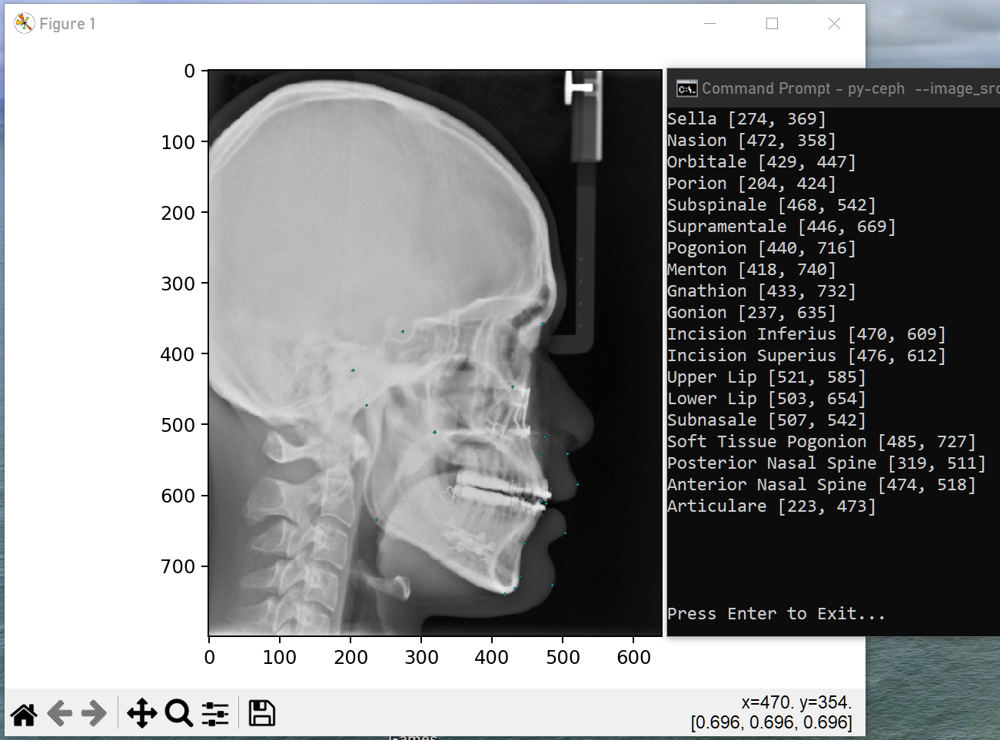

# Predict 19 Cephlometric Landmarks from a Cephalogram
PyTorch solution to find 19 cephalometric landmarks from a lateral cephalogram from CLI.

Model provided to predict landmarks is trained from the source code of [Cephalometric Landmark Detection by Attentive Feature Pyramid Fusion and Regression-Voting](https://arxiv.org/pdf/1908.08841.pdf). Repo [here](https://github.com/runnanchen/Anatomic-Landmark-Detection).

<br>

# How to use py-ceph?
py-ceph accepts CLI usage for single file interactive view or batch processing. 

Build the package by navigating to the package directory and running
```commandline
  pip install -e .
```

<br>

## Single file processing

```commandline
  py-ceph --image_src [my-single-image-path]
```

Output
- the image interactively with a grid
- the labeled landmarks to the console

<br><br>


## Batch processing

```commandline
  py-ceph --image_folder [my-image-folder-path]
```
Output
- create `predicted_images` folder in provided directory
  - each image overlayed with predicted ceph landmarks
  - csv of the coordinates for each labeled landmark

<br><br><br>

## To-do
- Non-CLI usage
- PyPi package

<br>

## Dependencies
- torch
- numpy
- torch
- matplotlib
- scikit-image